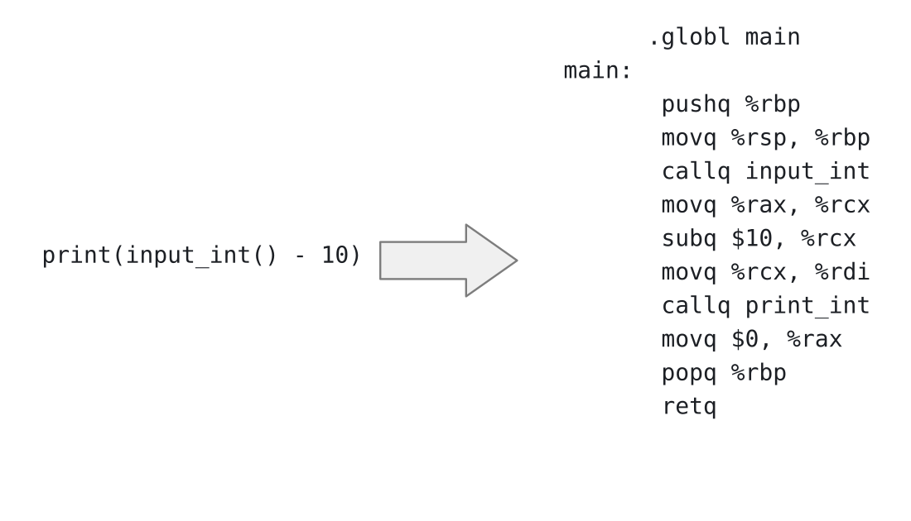
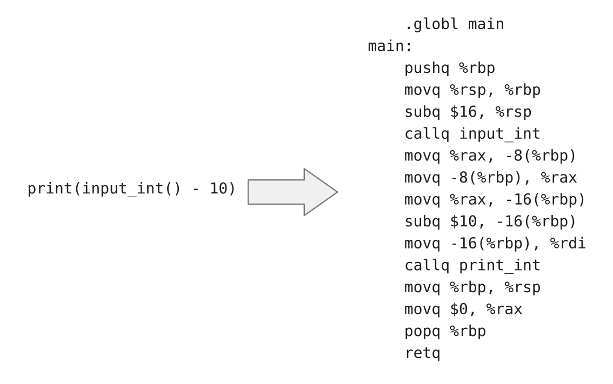
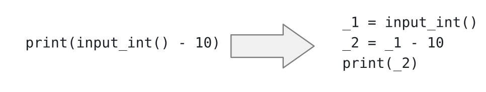
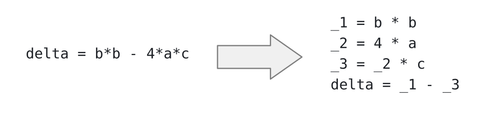
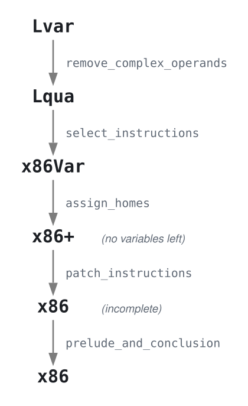

# Integers and Variables

Marcin Benke, MIM UW

Compiler Construction --- lecture 2

## Roadmap
Start: *Lvar* (Python subset)
- integers, arithmetic, variables, `print`, `input_int`

Target: x86-64 assembly

Intermediate steps:

- *Lqua* - quadruples (atomic arguments)
- *x86var* - x86 assembly with variables
- *x86+* - with hypothetical instructions e.g. `addq 24(%ebp), 32(%ebp)`

### Lvar vs x86

A translation might look like this:



- `input_int` returns result in `%rax`
- `%rcx` holds intermediate value of `input_int() - 10`
- `print` expects its argument in `%rdi`

### Lvar vs x86

We will handle registers next time, today we will put variables on the stack:



- `-8(%rbp)` holds the result of `input_int`
- `-16(%rbp)` holds intermediate value of `input_int() - 10`
- `print` expects its argument in `%rdi`

### Where we are going

We build a compiler from a small Python subset to x86-64 assembly.

Source language *Lvar*: integers, arithmetic, variables, `print`, `input_int`.

Target: x86-64 assembly (AT&T syntax, GNU as).

The whole compiler for this chapter is about 300 lines of Python.

We will not write it in one go. We split it into *passes*,
each doing one clearly identified job.


### Quadruples

Arithmetical calculations can be simplified into sequences of simpler operations called quadruples:

```
result = arg1 op arg 2
```

Translation examples:





Quadruples are closer to machine code yet still abstract.

### Two languages

We work with two source languages:

- *Lqua* --- operands of every operation are **atomic**
  (a constant or a variable);
- *Lvar* --- operands may be arbitrary expressions.

*Lqua* is called $L_{var}^{mon}$ in Siek's book (*mon* for *monadic*); no relation to Haskell monads.

Plan: 

- first compile *Lqua* all the way down to x86,
- then add one pass in front that translates *Lvar* to *Lqua*.

This way each pass we write is immediately testable end to end.

### Correctness criterion

Compilation must preserve behaviour:

```
               compile
           P1 -----------> P2
            |              |
interp_Lvar |              | run on x86
            v              v
            n ============ n
```

For every program `P1`, interpreting `P1` and running the compiled `P2`
must produce the same output.

### Lqua --- concrete syntax

```
Lqua ::= stmt*
stmt ::= var = exp | print(atm)
exp ::= atm * atm | atm + atm | - atm | atm - atm | input_int()
atm ::= int | var
```

It's a subset of Python, so we get the parser for free:

```
>>> from ast import parse, dump
>>> dump(parse('x = 12 + 20'))
"Module(body=[Assign(targets=[Name(id='x', ctx=Store())],
              value=BinOp(left=Constant(value=12),
                          op=Add(),
                          right=Constant(value=20)))])"
```

We can also use Python to interpret it by adding `import runtime` or

```
python3 <(cat runtime.py example.py)
```


### Lqua --- abstract syntax in Python

We reuse a subset of Python's own abstract syntax, from the standard `ast` module:

```
prog ::= Module(list[stmt])
stmt ::= Expr(Call(Name('print'), [atm]))
       | Assign([var], exp)
exp  ::= atm
       | Call(Name('input_int'), [])
       | UnaryOp(USub(), atm)
       | BinOp(atm, Add(), atm)
       | BinOp(atm, Sub(), atm)
       | BinOp(atm, Mul(), atm)
atm  ::= Constant(int) | var
var  ::= Name(str)
```

A program is a sequence of statements: assignments and `print`s.

Note: operands of `UnaryOp`/`BinOp` are **atoms**, not arbitrary expressions.

### Lvar --- abstract syntax

*Lvar* lifts that restriction:

```
prog ::= Module(list[stmt])
stmt ::= Expr(Call(Name('print'), [exp]))
       | Assign([var], exp)
exp  ::= atm
       | Call(Name('input_int'), [])
       | UnaryOp(USub(), exp)
       | BinOp(exp, Add(), exp)
       | BinOp(exp, Sub(), exp)
       | BinOp(exp, Sub(), exp)
atm  ::= Constant(int) | var
var  ::= Name(str)
```

Only difference: `exp` where *Lqua* had `atm`.

So *Lqua* is a sublanguage of *Lvar*.

### Concrete syntax

Lvar is also a subset of Python, so we get the parser for free:

```
>>> from ast import parse, dump
>>> dump(parse('x = 12 + 20'))
"Module(body=[Assign(targets=[Name(id='x', ctx=Store())],
              value=BinOp(left=Constant(value=12),
                          op=Add(),
                          right=Constant(value=20)))])"
```

A program:

```python
x = 12 + 20
print(10 + x)
```

prints 42.

### A remark on `print`

In Python, `print` is an ordinary function, so `print(e)` is a *call
expression*, and a statement containing it is an `Expr` node:

```
Expr(Call(Name('print'), [arg]))
```

Similarly `input_int()` is `Call(Name('input_int'), [])`.

`input_int` and `print_int` are provided by our runtime (`runtime.c`)

Why `print_int`? Python `print` is universal, so far we only consider int values,<br/>
but there will be more types in the future.


### Lvar vs x86 --- the gaps

1. x86 arithmetic instructions take **two** operands and update the
   second **in place**: `addq $7 %rcx`;<br/>
   *Lvar* operations take two arguments and
   produce a new value: `a = c + 7`
2. At most **one** operand may touch memory; some instructions have
   further restrictions.
3. *Lvar* operands may be arbitrarily nested expressions;<br/>
   x86 operands are immediates, registers, memory locations.
4. *Lvar* may use any number of variables; x86 has 16 registers plus
   the stack.

Each gap will be closed by a separate pass.

### Passes

- **`remove_complex_operands`** --- introduce temporaries so that every
  operand is atomic *(gap 3)*
- **`select_instructions`** --- translate each operation into a short
  sequence of x86 instructions *(gap 1)*
- **`assign_homes`** --- place variables in registers or on the stack
  *(gap 4)*
- **`patch_instructions`** --- repair instructions with two memory
  operands *(gap 2)*
- **`prelude_and_conclusion`** --- wrap the code in `main`

This is the *nanopass* style: many small passes, each with one
clearly stated objective.

### The pipeline



### x86Var --- x86 with variables

The output of `select_instructions` is not yet real x86:
it still contains program variables where operands should be.

```
dst ::= %reg | int(%reg) | Variable(str)
```

and it ignores the "at most one memory operand" restriction.

This is a deliberate simplification, each pass has one task:

- `select_instructions` worries only about choosing instructions,
- `assign_homes` only about placing variables,
- `patch_instructions` only about operand restrictions.

### Pass order 

Pass order is up to debate, here we chose a simple path:

- `select_instructions -> assign_homes`

We could instead run register assignment before instruction selection<br/>
--- this can produce better code in some cases, at the cost of a more complex pass.

For example

```
%eax = %edx + %ecx
```

might be translated to

```
leaq (%edx,%ecx), %eax
```

but this cannot be done if any of the args is a memory location.

When we talk about SSA, we will see another reason for putting register allocation first.

## Lqua to x86

### select_instructions

Translates *Lqua* statements to x86Var instructions.

Auxiliary functions: `select_arg` for atoms, `select_stmt` for statements.

Atoms:

```
Constant(n)  =>  $n
Name(x)      =>  Variable(x)          -- i.e. the variable, as is
```

### select_instructions --- arithmetic

`addq` updates in place, so in general:

```
var = atm1 + atm2       =>      movq src1, var
                                addq src2, var
```

If the target variable is itself an operand, one instruction suffices:

```
var = var - atm1       =>      subq src1, var
```

Negation:

```
var = -atm              =>      movq src, var
                                negq var
```

NOT `subq $0, var` !

### select_instructions --- input and output

`input_int` returns its result in `%rax` (the standard return register):

```
var = input_int()         =>    callq input_int
                                movq %rax, var
```

The first argument of a call goes in `%rdi`:

```
print(atm)              =>      movq src, %rdi
                                callq print
```

These are the only points where the runtime enters the picture.

### Beyond the book --- multiplication

The book's *Lvar* has only `+`, `-` and unary minus. Our labs add `*`.

`imulq` is *not* analogous to `addq`:

- its destination must be a **register**
- there is different form for multiplication by (32 bit) constant


```att
imulq %rcx, %rax             # ok
imulq -8(%rbp), %rax         # ok --- the source may be memory
imulq $13, -8(%rbp)          # ERROR: operand size mismatch
imulq $137, %rdx, %rax       # OK, RAX := 137 * RDX
```

The direct route is therefore to go through `%rax`:

```
var = atm1 * atm2       =>      movq  src1, %rax
                                imulq src2, %rax
                                movq  %rax, var
```

Three instructions --- always, whatever `var` turns out to be.

When we allocate registers, you can try to fiddle with it - see Additional Material at the end.

### Beyond the book --- division

`idivq` is stranger still:

- dividend in the **register pair** `%rdx:%rax`
- divisor in a register or memory --- **not** an immediate
- quotient ends up in `%rax`, remainder in `%rdx`

`cqto` sign-extends `%rax` into `%rdx:%rax` and must be issued first
(`cqo` is the Intel spelling; gas accepts both).

Computing `7 // 3` and `7 % 3`:

```att
movq  $7, %rax
movq  $3, %rcx      # divisor must not be an immediate
cqto                # sign-extend %rax into %rdx:%rax
idivq %rcx
                    # quotient in %rax, remainder in %rdx
```

Forgetting `cqto` leaves garbage in `%rdx` and gives wrong results or
a fault --- not a crash you want to debug at 2 a.m.

### select_instructions --- example

```python
a = input_int()
b = a - 1
print(b)
```

becomes

```att
callq input_int
movq %rax, a
movq a, b
subq $1, b
movq b, %rdi
callq print
```

Still x86Var: `a` and `b` are variables, not locations.

### assign_homes

Replace every variable by a stack location.

Assign variable *i* to `-8*i(%rbp)`:

```att
callq input_int              callq input_int
movq %rax, a               movq %rax, -8(%rbp)
movq a, b           =>     movq -8(%rbp), -16(%rbp)
subq $1, b                 subq $1, -16(%rbp)
movq b, %rdi               movq -16(%rbp), %rdi
callq print             callq print
```

Also compute the **frame size** --- number of variables times 8,
rounded up to a multiple of 16 <br/>
 --- `prelude_and_conclusion` will need it.

Putting every variable on the stack is wasteful. We will fix that
with register allocation in the next lecture.

### patch_instructions

`movq -8(%rbp), -16(%rbp)` has **two** memory operands --- illegal.

Route it through a scratch register (`%rax` is reserved for this):

```att
movq -8(%rbp), -16(%rbp)   =>   movq -8(%rbp), %rax
                                movq %rax, -16(%rbp)
```

The same corner case arises for an immediate that does not fit in
32 bits (`>= 2^31` or `< -2^31`) <br/> combined with a memory operand:

```att
movq $4294967296, -8(%rbp) =>   movq $4294967296, %rax
                                movq %rax, -8(%rbp)
```

### prelude_and_conclusion

Wrap the instruction sequence in `main`:

```att
    .globl main
main:
    pushq %rbp
    movq  %rsp, %rbp
    subq  $N, %rsp        # N = frame size, multiple of 16
    ...                   # the compiled program
    addq  $N, %rsp
    movq  $0, %rax        # exit code 0
    popq  %rbp
    retq
```

Setting `%rax` to 0 is optional but useful: the exit code of `main`
becomes the exit code of the process, 
<br/>and a nonzero one looks like a failure to test scripts.

We could use `movq %rbp, %rsp` (or even the **leave** instruction) instead of `addq $N, %rsp`; there is a reason we do not.

### Worked example

```python
a = input_int()
mone = -1        # unary minus
b = a - mone
print(b)
```

`select_instructions`:

```att
callq input_int
movq %rax, a
movq $1, mone
negq mone
movq a, b
subq mone, b
movq b, %rdi
callq print
```

### Worked example, continued

After `assign_homes`, `patch_instructions` and
`prelude_and_conclusion` (3 variables, so `subq $32`):

```att
    .globl main
main:
    pushq %rbp
    movq  %rsp, %rbp
    subq  $32, %rsp
    callq input_int
    movq  %rax, -8(%rbp)
    movq  $1, -16(%rbp)
    negq  -16(%rbp)
    movq  -8(%rbp), %rax
    movq  %rax, -24(%rbp)
    movq  -16(%rbp), %rax
    subq  %rax, -24(%rbp)
    movq  -24(%rbp), %rdi
    callq print
    addq  $32, %rsp
    movq  $0, %rax
    popq  %rbp
    retq
```

That's a lot of memory traffic - we will fix it next week.

## Lvar to Lqua

### remove_complex_operands

Now the missing front pass: make every operand atomic by binding
complex subexpressions to fresh temporary variables.

```python
x = 42 + -10          =>      tmp_0 = -10
print(x + 10)                 x = 42 + tmp_0
                              tmp_1 = x + 10
                              print(tmp_1)
```

Output language is exactly *Lqua*.

Atomic expressions are **pure** --- they neither cause nor depend on
side effects.<br/> Complex ones (like `input_int()`) may not be reordered
relative to each other.

Assignment is arguably a side-effect, consider

```
x = x + 1
x = 2 * x
```

This can be solved using so called Static Single Assignment (SSA) form:

```
x1 = x0 + 1
x2 = 2 * x1
```
We will talk about SSA later.

### Why "monadic normal form"

Separating pure atoms from possibly-effectful complex expressions is
exactly the structure of *monadic normal form* (Moggi 1991), hence
the name $L_{var}^{mon}$ in the book.

The closely related *administrative normal form* (ANF) additionally
flattens nested bindings.

The practical payoff: from here on, evaluation order is fixed by
the statement sequence, not by a traversal of nested expressions.

### Implementation

Two recursive functions:

```python
def rco_exp(self, e: expr, need_atomic: bool) -> Tuple[expr, Temporaries]:
    ...

def rco_stmt(self, s: stmt) -> List[stmt]:
    ...
```

`rco_exp` returns the rewritten expression together with a list of
`(temporary, initialiser)` pairs to be emitted before it.

`need_atomic` says whether the caller requires an atom:
operands of `UnaryOp`/`BinOp`/`print` do,<br/>
right-hand sides of assignments do not.

Use a counter (or `ast_utils.generate_name`) to produce fresh names.

### remove_complex_operands --- the rule

Sketch of `rco_exp`, in the same before/after style as `select_instructions`:

``` python
rco_exp(atm, need_atomic)          =>  atm, []

rco_exp(BinOp(l, op, r), need_atomic)
                                    =>  l2, tmps_l = rco_exp(l, True)
                                        r2, tmps_r = rco_exp(r, True)
                                        e = BinOp(l2, op, r2)
                                        if need_atomic:
                                            t = fresh()
                                            return t, tmps_l + tmps_r + [(t, e)]
                                        else:
                                            return e, tmps_l + tmps_r
```

The subexpressions of a `BinOp`/`UnaryOp` are always recursed into with
`need_atomic=True` --- they must end up atomic regardless of the caller.

OTOH when simplifying an assignment we will call `rco_exp(rhs, need_atomic=False)`

This is  why `x=input_int()` is left alone,
but when nested inside `+` it gets hoisted into a temporary. 

### Another example


Names like `_1` assume the source does not use them.<br/>
To be extra safe, you may use names that are not valid Python identifiers (like `%tmp1`) or a dedicated AST node.

I am using `_n` so that the output is valid Python.

### Do not over-generate

Assignments whose right-hand side is *already* atomic must be left
alone:

```python

a = input_int()                =>    a = input_int()
b = a + 2                            b = a + 2
print(b)                             print(b)
```

A careless implementation produces

```python
_1 = input_int()
a = _1
_2 = a
_3 = _2
b = _2 + _3
_4 = b
print(_4)
```

Technically correct, but every wasted temporary costs a stack slot and two moves.

## Summary

- Break the compiler into passes, one gap per pass.
- Write the interpreter first: it is the specification and the oracle.
- Keep intermediate languages explicit (*Lqua*, x86Var) --- they
  document what each pass guarantees.
- Test after every pass, comparing against the interpreter.

Next time: registers are much faster than memory.<br/>
Which variables get one? --- **register allocation** via graph
colouring.

# Questions?

# Additional material

### Multiplication --- who should decide?

`select_instructions` does not know where `var` lives; that is
`assign_homes`' business. So we can equally well select the `addq`
shape and leave the restriction to `patch_instructions`:

```
var = atm1 * atm2       =>      movq  src1, var
                                imulq src2, var
```

A memory destination is then repaired with a scratch register and a
write-back --- which `movq` patching does not need, since there the
scratch register already holds the value being moved:

```att
imulq -8(%rbp), -16(%rbp)  =>   movq  -16(%rbp), %rax
                                imulq -8(%rbp), %rax
                                movq  %rax, -16(%rbp)
```

Match on the **destination**, not on "two memory operands":
`imulq $13, -8(%rbp)` is illegal too, and the immediate is not what
makes it illegal.

### Multiplication --- and if `var` gets a register?

Then there is nothing to repair:

```att
imulq -8(%rbp), %rcx           # already legal
```

Today that is hypothetical: every variable is on the stack, and
patching instructions one at a time is in fact *worse*. `c = a * b`
comes out as five instructions rather than three, storing `c` and
loading it straight back:

```att
movq  -24(%rbp), %rax
movq  %rax, -8(%rbp)         # movq a, c, patched
movq  -8(%rbp), %rax
imulq -16(%rbp), %rax        # imulq b, c, patched
movq  %rax, -8(%rbp)
```

Committing to `%rax` in `select_instructions` settles the question
before the allocator ever sees the program.

Leaving it to
`patch_instructions` costs two instructions now and saves them later.

### Multiplication by a constant

`imul` also has a three-operand form --- unusual in that the
destination is written but not read:

```att
imulq $13, -8(%rbp), %rax      # %rax = -8(%rbp) * 13
```

AT&T order is `imm, src, dst`. The source may be memory, the
destination must still be a register, and the immediate must fit in
32 bits. `imulq $13, %rbx` is the same instruction with `src` and
`dst` coinciding.

So `x = 13 * y` can become a single instruction once `x` has a
register, reading `y` straight from its stack slot.

Small constants are a different matter: `x = 4 * y` is better served
by `leaq (,%ry,4), %rx` or a shift. 

Strength reduction is a topic of
its own --- `imulq` is the general answer, not always the best one.
