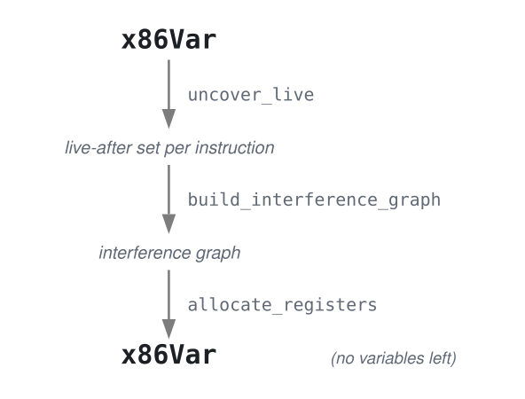
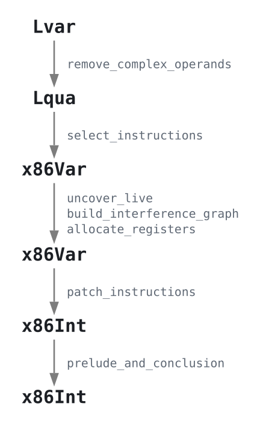
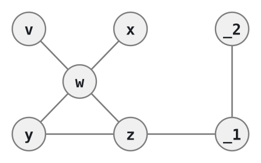
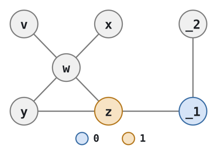
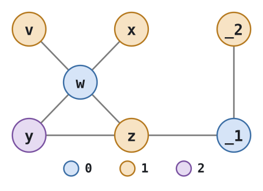

# Register Allocation

Marcin Benke, MIM UW

Compiler Construction --- lecture 3

## Roadmap

### Where we left off

`assign_homes` put **every** variable on the stack:

```att
callq input_int
movq  %rax, -8(%rbp)
movq  -8(%rbp), %rax
movq  %rax, -16(%rbp)
subq  $1, -16(%rbp)
movq  -16(%rbp), %rdi
callq print_int
```

Correct but slow: every value makes a round trip through memory;<br/>
`patch_instructions` has to insert extra moves through `%rax`
whenever two memory operands meet.

### Why registers

Rough costs on x86-64:

| Access            | Latency        |
|-------------------|----------------|
| register          | ~1 cycle       |
| L1 cache hit      | ~4--5 cycles   |
| L2 / L3           | ~14 / ~40      |
| main memory       | >100           |

The top of the stack is almost always in L1, so the stack is not
catastrophic<br/>
 --- but a register operand is still several times cheaper
and does not occupy a load/store unit.

We have 16 registers, of which about 11 are usable. Programs have more
variables than that.<br/>
So: which variables get one?

### The key observation

```python
v = 1
w = 42
x = v + 7
y = x
z = x + w
print(z + (- y))
```

After `x = v + 7`, the variable `v` is never read
again

**Two variables that are never in use at the same time can share a
register.**

- `x` and `v` can use the same register
- `z` and `y` cannot (they *interfere*)

Making this precise is the content of this lecture.

### Three new passes



`uncover_live` and `build_interference_graph` are *analyses*: they compute
information, they do not change the program.

`allocate_registers` replaces the old `assign_homes`.

### The full pipeline



`patch_instructions` and `prelude_and_conclusion` both need small
extensions; everything before `select_instructions` is untouched.

### Simplifying assumption

Each variable gets **one** home for its whole lifetime.

Real compilers do better: a variable used heavily in one region and
then again much later<br/>
can live in a register for the first region and
be moved to the stack in between (*live range splitting*).

We will not do that. See Cooper & Torczon, ch. 13.

## Calling conventions

### The rules of the game

Our code is not alone: the operating system calls `main`, and we call
`input_int` and `print_int`. We follow the **System V AMD64** calling
convention (what GCC and Clang use on Linux).

Arguments, in order:

```
   rdi  rsi  rdx  rcx  r8  r9
```

Return value: `%rax`.

More than six arguments --- the rest go on the stack (or heap).

### Caller-saved and callee-saved

Someone has to preserve register contents across a call.
The convention splits the work:

**caller-saved** (the callee may clobber them freely):

```
   rax rcx rdx rsi rdi r8 r9 r10 r11
```

**callee-saved** (the callee must restore them before returning):

```
   rsp rbp rbx r12 r13 r14 r15
```

### Two points of view

As the **caller** (we call `input_int`):

- assume every caller-saved register is destroyed by the call;
- assume every callee-saved register survives it.

As the **callee** (we *are* `main`):

- caller-saved registers are ours to use, no bookkeeping needed;
- a callee-saved register must be pushed in the prelude and popped
  in the conclusion before we may touch it.

This is why the prelude always begins with `pushq %rbp`: `%rbp` is
callee-saved.

## Liveness analysis

### Live

> A location is **live** at a program point if its current value may be
> read at some later point.

*Location* = variable, register, or stack slot.

```att
movq $5, a       1
movq $30, b      2
movq a, c        3
movq $10, b      4
addq b, c        5
```

Are `a` and `b` ever live at the same time?

### Live

```att
movq $5, a       1
movq $30, b      2
movq a, c        3
movq $10, b      4
addq b, c        5
```

*Are `a` and `b` ever live at the same time?*

No. `a` is live from 1 to 3, `b` from 4 to 5.

The value written to `b` at line 2 is **dead**: it is overwritten at
line 4 before any read.

So `a` and `b` may share a register --- even though a naive
"is it in scope?" reading would say otherwise.

### The equations

For instructions $I_1,\ldots,I_n$, write

- `L_after(k)` --- locations live after $I_k$
- `L_before(k)` --- locations live before $I_k$
- `R(k)` --- locations **read** by $I_k$
- `W(k)` --- locations **written** by $I_k$

```
L_after(n)  = {}
L_after(k)  = L_before(k+1)
L_before(k) = (L_after(k) - W(k)) U R(k)
```

Note the order: *subtract writes, then add reads*.
An instruction that both reads and writes a location keeps it live.

### Computing it

The equations are read back to front, so the analysis runs
**backwards** over the instruction list --- one pass is enough (for now).

(With loops this becomes a proper dataflow problem that requires computing a fixpoint.)

```att
movq $5, a       Lb = {}        La = {a}
movq $30, b      Lb = {a}       La = {a}
movq a, c        Lb = {a}       La = {c}
movq $10, b      Lb = {c}       La = {b,c}
addq b, c        Lb = {b,c}     La = {}
```

### Read and write sets

Per instruction:

| Instruction        | R                  | W                    |
|--------------------|--------------------|----------------------|
| `movq s, d`        | `s`                | `d`                  |
| `addq s, d`        | `s`, `d`           | `d`                  |
| `subq s, d`        | `s`, `d`           | `d`                  |
| `negq d`           | `d`                | `d`                  |
| `imulq s, d`       | `s`, `d`           | `d`                  |
| `imulq $n, s, d`   | `s`                | `d`                  |
| `imulq x`          | `x`, `%rax`,       | `%rax`, `%rdx`       |
| `idivq x`          | `x`, `%rax`, `%rdx`| `%rax`, `%rdx`       |
| `leaq (x, y), d`   | `x`, `y`           | `d`
| `callq f`          | arg registers      | *all* caller-saved   |

Immediates contribute nothing. `n(%rbp)` reads `%rbp`, but we treat
frame addressing as invisible here;<br/>
`%rbp` is never allocated.

### callq is the interesting one

```
R(callq f, n) = { rdi, rsi, rdx, rcx, r8, r9 }[:n]
W(callq f, n) = { rax, rcx, rdx, rsi, rdi, r8, r9, r10, r11 }
```

The write set is the whole caller-saved group: as far as we know, the
callee destroys all of them.

This is exactly why the abstract syntax of `Callq` carries the
**arity**:

- callq input_int` reads nothing,
- `callq print_int` reads `%rdi`.

### The running example

```python
v = 1
w = 42
x = v + 7
y = x
z = x + w
print(z + (- y))
```

after `remove_complex_operands` and `select_instructions`:

```att
movq $1, v
movq $42, w
movq v, x
addq $7, x
movq x, y
movq x, z
addq w, z
movq y, _1
negq _1
movq z, _2
addq _1, _2
movq _2, %rdi
callq print_int
```

### The running example --- live-after sets

```att
movq $1, v          {v}
movq $42, w         {v, w}
movq v, x           {w, x}
addq $7, x          {w, x}
movq x, y           {w, x, y}
movq x, z           {w, y, z}
addq w, z           {y, z}
movq y, _1          {z, _1}
negq _1             {z, _1}
movq z, _2          {_1, _2}
addq _1, _2         {_2}
movq _2, %rdi       {%rdi}
callq print_int      {}
```

Seven variables, but never more than three live at once.

## The interference graph

### Interference

Two locations **interfere** if they are live at the same time and
therefore cannot share a home.

Represent this as an undirected graph:

- one vertex per variable **and per register**;
- an edge between locations that interfere.

`graph.py` in the support code provides `UndirectedAdjList`.

### Do not use the obvious algorithm

Tempting: for each program point, add an edge between every pair in
the live set.

Two problems.

1. Quadratic in the size of each live set, at every instruction.
2. **Wrong** --- too conservative.<br/>
   After `movq x, y` the variables
   `x` and `y` may be both live, but they hold the *same value*.
   Sharing a register is perfectly fine.

### Focus on writes instead

An instruction can only break something by **writing**.<br/>
So look at
what each instruction writes, and connect it to what is live after it.

1. For `movq s, d`: for every `v` in `L_after(k)`
   with `v != d` and `v != s`, add the edge `(d, v)`.

2. For any other instruction: for every `d` in `W(k)` and every `v` in
   `L_after(k)` with `v != d`, add the edge `(d, v)`.

Linear in the number of instructions times the size of the live sets,
and the `movq` case captures the shared-value insight.

**Example:**

```att
movq $5, a       Lb = {}        La = {a}
movq $30, b      Lb = {a}       La = {a}
movq a, c        Lb = {a}       La = {c}     # no edge
movq $10, b      Lb = {c}       La = {b,c}   # edge b <-> c
addq b, c        Lb = {b,c}     La = {}      # no edge
```

We only need two registers: a,c share one; b uses the other.

We could even make do with one register, but that's a topic for later.

### Building the graph --- the example

```
Instruction        live-after        edges added

movq $1, v          {v}              --
movq $42, w         {v, w}           w-v
movq v, x           {w, x}           x-w
addq $7, x          {w, x}           x-w
movq x, y           {w, x, y}        y-w      (not y-x!)
movq x, z           {w, y, z}        z-w, z-y
addq w, z           {y, z}           z-y
movq y, _1          {z, _1}          _1-z
negq _1             {z, _1}          _1-z
movq z, _2          {_1, _2}         _2-_1
addq _1, _2         {_2}             --
movq _2, %rdi       {%rdi}            --
callq print_int     {}               --
```

`movq x, y` is the rule-1 case: `y` interferes with `w` but **not**
with `x`, since `x` is the source of the move.

### The interference graph



Adjacency, as your compiler will print it:

```
v : w
w : v, x, y, z
x : w
y : w, z
z : w, y, _1
_1: z, _2
_2: _1
```

Seven variables, seven edges. `w` is the busiest vertex.

## Graph colouring

### The problem

Assign each vertex a colour such that adjacent vertices get different
colours, using as few colours as possible.

Colours = locations. Colours `0..k-1` are registers; `k` and above are
stack slots.

You have played this game: **Sudoku is graph colouring.** 

- One vertex per square, 
- an edge between squares sharing a row, a column or a 3x3 block, 
- nine colours, 
- some vertices precoloured by the initial board.

### Sudoku heuristics are colouring heuristics

*Pencil marks*: write in each square the numbers still available.
In graph terms this is **saturation**:

```
saturation(u) = { colour(v) | v adjacent to u }
```

*Fill in a square with only one possibility left first.*
In graph terms: process the vertex with the **highest saturation**
first --- the most-constrained-first heuristic.

A sudoku player who gets stuck backtracks. We will not.

### Why we need not backtrack

Optimal graph colouring is NP-hard, and it really is hard here:
Chaitin showed that *every* graph arises as the interference graph of
some program.

But register allocation is easier than sudoku: when we run out of
registers we **spill** to the stack. There is always a legal answer,
just a worse one.

So: greedy, no backtracking. Choose the best-looking vertex, give it
the lowest available colour, never revisit.

### DSATUR

```
Input:  graph G = (V, E), ordered set of colours C
Output: colour: V → C

W := V - precoloured vertices
while W is not empty:
    pick u in W with the highest saturation
        (ties broken arbitrarily)
    c := min(C - { colour[v] : v adjacent to u })
    colour[u] := c
    W := W - {u}
```

Due to Brelaz (1979). Precoloured vertices (the registers) start out
coloured and are not in `W`.

Use a priority queue keyed on saturation; remember to notify it when a
neighbour's colour changes.

We can add preferred colours, e.g. `%rdi` for argument, `%rax` for function result etc.

### Start simpler

For a first working version, drop the heuristic entirely:

```python
for v in graph.vertices():
    if isinstance(v, Variable):
        used = {color[n] for n in graph.adjacent(v) if n in color}
        c = 0
        while c in used: c += 1
        color[v] = c
```

Plain greedy in arbitrary order. It is correct --- it just uses more
colours. Get the whole pipeline running with this, then swap in
saturation and measure the difference.

Keep colours in a separate dict; do not store them in the vertices.

### Colouring the example


```
_1: -, {}      _2: -, {}      v: -, {}
 z: -, {}       w: -, {}      x: -, {}      y: -, {}
```

All equally saturated --- pick `_1`, colour it `0`.
Neighbours `_2` and `z` now have `0` in their saturation.

```
_1: 0, {}      _2: -, {0}     v: -, {}
 z: -, {0}      w: -, {}      x: -, {}      y: -, {}
```

Most saturated: `_2` and `z`. Take `z`, colour `1`;
`_1`, `y`, `w` gain `1`.

### Colouring the example, continued

```
_1: 0, {1}     _2: -, {0}     v: -, {}
 z: 1, {0}      w: -, {1}     x: -, {}      y: -, {1}
```



`w` gets `0`; `v`, `x`, `y` gain `0`.
Then `y` is most saturated with `{0,1}` --- it gets `2`.
`v` gets `1`, `x` gets `1`, `_2` gets `1`.

Final colouring:

```
{ v: 1, w: 0, x: 1, y: 2, z: 1, _1: 0, _2: 1 }
```

### Final colouring




```
{ v: 1, w: 0, x: 1, y: 2, z: 1, _1: 0, _2: 1 }
```
Three colours for seven variables.

### Colours to locations

The book's numbering, which is also what the support code uses:

```
  0: rcx   1: rdx   2: rsi   3: rdi   4: r8   5: r9
  6: r10   7: rbx   8: r12   9: r13  10: r14

 -1: rax  -2: rsp  -3: rbp  -4: r11  -5: r15
```

`k = 11` usable registers; colour `11+i` is stack slot `i`; 

`r11, r15` are reserved for future use

Colours 0--6 are caller-saved, 7--10 callee-saved --- so
"lowest available colour" automatically prefers caller-saved
registers, exactly as we wanted.

`%rax` stays out of the pool: `patch_instructions` needs a scratch
register.

### Call-live variables

A variable in use *during* a call is **call-live**.

```python
x = input_int()
y = input_int()
print((x + y) + 42)
```

`x` is call-live: it is live across the second `callq input_int`.

Three options for `x`:

1. put it in a caller-saved register and spill it around every call
   --- lots of memory traffic;
2. put it on the stack from the start --- one slot, no register;
3. put it in a **callee-saved** register --- saved once in the
   prelude, restored once in the conclusion.

Option 3 wins when the variable is used more than once or twice.

### Encoding the preference

We do not want to complicate the allocator with special cases. Instead
we encode both preferences in the data:

- add an interference edge between every call-live variable and every
  **caller-saved** register;<br/>
  --- the allocator then simply cannot put
  it there;
- number the colours so that caller-saved registers come first,
  callee-saved next, stack locations last.

Then "prefer caller-saved for short-lived variables, callee-saved for
call-live ones, stack only as a last resort" falls out of
*always pick the lowest available colour*.

### Registers in the graph

Registers are vertices too, and they are **precoloured**:

- `callq` writes all caller-saved registers, so rule 2 connects every
  call-live variable to all of them --- this is the call-live
  treatment from earlier, and it needs no extra code;
- `movq %rax, x` after a call makes `%rax` a genuine graph vertex;
- reserved registers (`%rax`, `%rsp`, `%rbp`, `%r11`, `%r15`) get
  negative colours so no variable can be assigned to them.


### Testing spills

With eleven registers, small test programs never spill --- and the
interesting bugs are all in the spilling path.

Do **not** write a program with fifty variables. Instead make the
register pool a parameter:

```
$ uv run ra.py tests/delta.py --registers 2
```

Two or three registers turn most existing tests into a
spilling test. 
lab.

### Applying it --- one register

Suppose only `%rcx` is available: `0 ↦ %rcx`, `1 ↦ -8(%rbp)`,
`2 ↦ -16(%rbp)`.

```att
movq $1, v                 movq $1, -8(%rbp)
movq $42, w                movq $42, %rcx
movq v, x                  movq -8(%rbp), -8(%rbp)    # !
addq $7, x                 addq $7, -8(%rbp)
movq x, y                  movq -8(%rbp), -16(%rbp)
movq x, z         =>       movq -8(%rbp), -8(%rbp)    # !
addq w, z                  addq %rcx, -8(%rbp)
movq y, _1                 movq -16(%rbp), %rcx
negq _1                    negq %rcx
movq z, _2                 movq -8(%rbp), -8(%rbp)    # !
addq _1, _2                addq %rcx, -8(%rbp)
movq _2, %rdi              movq -8(%rbp), %rdi
callq print_int            callq print_int
```

Note what just appeared: `movq -8(%rbp), -8(%rbp)`.

There are everal ways to fix this, we start with simplest: `patch_instructions`

### patch_instructions, extended

Two jobs now.

As before, split instructions with two memory operands:

```att
movq -8(%rbp), -16(%rbp)  =>  movq -8(%rbp), %rax
                              movq %rax, -16(%rbp)
```

And new: **delete trivial moves**, where source and destination are
the same location.

```att
movq -8(%rbp), -8(%rbp)   =>  (nothing)
movq %rcx, %rcx           =>  (nothing)
```

These arise precisely when the allocator gave two move-related
variables the same home<br/> --- a success, not an accident.

Be careful not to delete instructions such as
```att
addq -8(%rbp), -8(%rbp)
imulq %rcx, %rcx
```

### The example after patching

```att
movq  $1, -8(%rbp)
movq  $42, %rcx
addq  $7, -8(%rbp)
movq  -8(%rbp), %rax
movq  %rax, -16(%rbp)
addq  %rcx, -8(%rbp)
movq  -16(%rbp), %rcx
negq  %rcx
addq  %rcx, -8(%rbp)
movq  -8(%rbp), %rdi
callq print_int
```

Thirteen instructions down to eleven, with one register.
With two registers we can do better.

### Saving callee-saved registers

If the allocator handed out `%rbx`, `%r12`, ... then `main` must
preserve them:

```att
main:
    pushq %rbp
    movq  %rsp, %rbp
    pushq %rbx       
    pushq %r12       # only those actually used
    subq  $A, %rsp
    ...
    addq  $A, %rsp
    popq  %r12
    popq  %rbx
    popq  %rbp
    retq
```

`used_callee` comes from `allocate_registers`.
Push and pop in **opposite** orders.

Save register before `subq $A, %rsp`; restore after `addq ....`

If no callee-save registers are used, then we can use faster conclusion:

```att
leave
retq
```
instead of `addq ... popq ... retq` 

### How much to subtract

`%rsp` must be a multiple of 16 before every `callq`, and the
register pushes have already moved it.

Let

- `S` = number of stack slots used by spilled variables,
- `C` = number of callee-saved registers actually used,
- `align(n)` = `n` rounded up to a multiple of 16.

```
A = align(8S + 8C) - 8C
```

We subtract `8C` because the `C` pushes already lowered `%rsp` by
that much.

`S` can be smaller than the number of spilled variables: two
non-interfering spilled variables share a slot.

### Where the spill slots go

The pushes come first, so the saved registers occupy
`-8(%rbp)`, `-16(%rbp)`, ... and spill slots start **below** them.

With `C = 1` (`%rbx` saved) and `S = 1`:

```
   8(%rbp)   return address
   0(%rbp)   saved %rbp
  -8(%rbp)   saved %rbx
 -16(%rbp)   spilled variable 0
```

`A = align(8 + 8) - 8 = 16 - 8 = 8`, so `subq $8, %rsp`.

Getting this offset wrong corrupts `%rbx` on return --- and the crash
happens in your *caller*,<br/>
which is a miserable thing to debug.

### The example with two registers

Colouring `{v:1, w:0, x:1, y:2, z:1, _1:0, _2:1}` with
`0 ↦ %rcx`, `1 ↦ %rbx`, `2 ↦ spill`:

```att
    .globl main
main:
    pushq %rbp
    movq  %rsp, %rbp
    pushq %rbx
    subq  $8, %rsp
    movq  $1, %rbx
    movq  $42, %rcx
    addq  $7, %rbx
    movq  %rbx, -16(%rbp)
    addq  %rcx, %rbx
    movq  -16(%rbp), %rcx
    negq  %rcx
    addq  %rcx, %rbx
    movq  %rbx, %rdi
    callq print_int
    addq  $8, %rsp
    popq  %rbx
    movq  $0, %rax
    popq  %rbp
    retq
```

Eleven instructions became **nine**, three of them deleted trivial
moves. Compare with the all-on-the-stack version from lecture 2.

### A worked call-live example

```python
x = input_int()
y = input_int()
print((x + y) + 42)
```

```att
callq input_int       {%rax}
movq %rax, x          {x}
callq input_int       {x, %rax}      <-- x is call-live
movq %rax, y          {x, y}
movq x, _1            {y, _1}
addq y, _1            {_1}
movq _1, _2           {_2}
addq $42, _2          {_2}
movq _2, %rdi         {%rdi}
callq print_int       {}
```

The second `callq` writes all caller-saved registers while `x` is
live,<br/>
so `x` interferes with `rax, rcx, rdx, rsi, rdi, r8, r9, r10,
r11` --- colours 0 to 6 and -1, -4 are all taken.

### A worked call-live example, continued

Lowest available colour for `x` is **7 = `%rbx`**, a callee-saved
register; `y` is not call-live, so it gets `%rcx`.

```att
    .globl main
main:
    pushq %rbp
    movq  %rsp, %rbp
    pushq %rbx
    subq  $8, %rsp
    callq input_int
    movq  %rax, %rbx
    callq input_int
    movq  %rax, %rcx
    movq  %rbx, %rdx
    addq  %rcx, %rdx
    movq  %rdx, %rcx
    addq  $42, %rcx
    movq  %rcx, %rdi
    callq print_int
    addq  $8, %rsp
    popq  %rbx
    movq  $0, %rax
    popq  %rbp
    retq
```

No spills (`S = 0`), yet still `subq $8` --- purely for alignment,
since `C = 1`.

## Refinements

### Start crude, then refine

A working-but-dumb allocator first:

1. save and restore **all** callee-saved registers in the prelude
   and conclusion, unconditionally;
2. allocate **only** callee-saved registers.

Then call-live variables need no special treatment at all, and the
prelude is a constant. Get the tests passing.

Then, one at a time:

- only save used registers; 
- admit the caller-saved registers; 
- add the call-live edges; 
- add saturation.

Keep the stack-only `assign_homes` around so you can diff the output.

### Extension --- move biasing

Look again:

```att
movq x, y
```

If `x` and `y` end up in the same register this move disappears.
Two variables appearing together in a `movq` are **move related**.

Build a second graph, the *move graph*. Then:

- among equally saturated vertices, prefer one that is move related to
  an already-coloured vertex;
- when choosing a colour, prefer one already given to a move-related
  neighbour.

Only as a tie-break --- never at the cost of spilling.

### Move biasing --- payoff

On the running example, biasing lets `y` and `_1` share a register,
removing one more move.

Historically this came in two flavours:

- **coalescing** (Chaitin 1981) --- merge move-related non-interfering
  vertices *before* colouring.<br/>
  Fewer moves, but a harder graph to colour;<br/>
  refined into *conservative* coalescing (Briggs 1994) and
  *iterated* coalescing (George & Appel 1996).
- **biased colouring** (Briggs 1994) --- what we just described. Never
  makes the graph harder.

### Further reading

- Chaitin (1981, 1982) --- graph colouring allocation, and spilling.
- Briggs (1994) --- optimistic colouring: do not spill a high-degree
  vertex eagerly, defer the decision until its neighbours are
  coloured. Equivalent to smallest-last ordering.
- Poletto & Sarkar (1999) --- *linear scan*: no graph at all, just
  live intervals. Much faster, slightly worse code; used by JITs.
- Hack (2007), Bouchez et al. (2006) --- interference graphs of
  programs in SSA form are **chordal**, hence optimally colourable in
  polynomial time. The hardness lives in the spilling and coalescing,
  not the colouring.

## Wrapping up

### Summary

- A variable is **live** if its value may still be read; compute
  live-after sets by one backward sweep.
- Two locations **interfere** if one is written while the other is
  live --- with `movq` excused, because both hold the same value.
- Register allocation = colouring the interference graph; registers
  are precoloured vertices.
- Spilling makes greedy colouring good enough; saturation
  (most-constrained-first) makes it better.
- Order the colours caller-saved, callee-saved, stack, and add
  call-live/caller-saved edges --- then the calling convention is
  respected for free.

Next time: booleans and conditionals. Branching turns liveness into a
real dataflow problem.

### Lab tasks

1. Implement `block_live`, after `select_instructions`.
   Key the live sets by instruction **index**.
2. Compute the call-live variables.
3. Get to know `graph.py`; `graphviz` gives you pictures<br/>
   (`uv add graphviz`, then `g.show().render(view=True)`).
4. Implement `build_interference_graph`; add the registers, precolour them,
   and add the call-live edges.<br/>
   Check against a graph you built by
   hand.
5. Colour the graph --- greedy first, then saturation.
6. Rework `assign_homes` into `allocate_registers`; keep the old one
   for comparison. Add a `--registers n` switch and write at least
   five tests, including ones that spill.
7. Extend `prelude_and_conclusion` to save the used callee-saved
   registers, keeping `%rsp` 16-byte aligned.

Details in `03ra/03graph.md`.

### Questions?

## Implementation hints

### Live-set implementation --- a warning

The book suggests a dictionary mapping *instruction* to live-after
set. That only works if instructions compare by **identity** --- and
it is not an accident that they do:

```python
@dataclass(frozen=True, eq=False)        # <-- eq=False
class Instr(instr):
    instr: str
    args: tuple[arg, ...]
```

`eq=False` suppresses the generated `__eq__`, leaving identity
equality and hashing. Drop it, and two occurrences of
`movq %rax, %rdi` become the *same* key --- the second live-after set
silently overwrites the first.

The argument classes are deliberately the opposite: `Reg`, `Variable`,
`Deref` are plain `frozen=True`, because they must compare
structurally to serve as set elements and graph vertices.

Safest: key by instruction **index** and do not rely on the
distinction at all.

### Implementation --- structure

Three auxiliary functions, mirroring the equations:

```python
def arg_locations(self, a: x86.arg) -> set[Variable | Reg]: ...
def instr_read_set(self, i: x86.instr) -> LiveSet:  ...
def instr_write_set(self, i: x86.instr) -> LiveSet: ...
```

then

```python
def block_live(self, instrs, live_after_block):
    live_before = live_after_block
    for k in range(len(instrs) - 1, -1, -1):
        self.live_after[k] = live_before
        live_before = ((live_before - self.instr_write_set(instrs[k]))
                       | self.instr_read_set(instrs[k]))
```

Print the annotated listing under `-v`. You will read it a lot.

